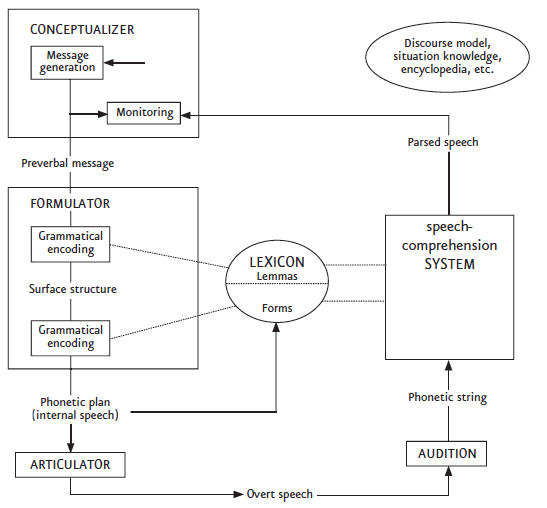

## Übersicht

-   Vorstellungsrunde
-   Informationen zum Kurs
-   Übersicht und Leistungsnachweise
-   Einführung ins Thema

## Ziele von heute sind, dass ...

::: incremental
-   wir uns kennenlernen
-   Sie einen Überblick über den Verlauf des Kurses und die Anforderungen haben
-   wissen, was wir in der Psycholinguistik erforschen und ...
-   ... mit was wir uns hier spezifisch im Seminar befassen werden
:::

## Vorstellungsrunde

-   Name & wie Sie angesprochen werden wollen
-   Studiengang
-   Grund für die Wahl des Kurses
-   Sprachen, die Sie sprechen, oder die Sie gerne lernen würden

## Allgemeine Informationen

-   Donnerstag, 14:00-15:30, Seminarraum rechts
-   Keine Sprechstunde, kontaktieren Sie mich per Email
-   Folien und Seminar auf Deutsch, Lektüre vorwiegend auf Englisch
-   Seminar im SM1:
    -   Kontaktzeit: 30h
    -   Selbststudium: 60h

------------------------------------------------------------------------

## Form des Seminars

-   hauptsächlich Lesen und Diskutieren von Artikeln aus Fachzeitschriften
-   d.h. wenig Frontalunterricht

## Frage an Sie

**Was wünschen Sie sich für eine angenehme und produktive Zusammenarbeit?**

## Was ich von Ihnen erwarte

:::: r-fit-text
::: incremental
-   respektvollen Umgang, es ist mir wichtig das alle sich wohl fühlen
-   Unterschiede und Diversität werden als Gewinn und nicht als Nachteil betrachtet
-   Trauen Sie sich Fragen zu stellen, Ihre Meinung zu äußern und Gedanken zu teilen. Es gibt keine "doofen" Fragen & Kommentare
-   Rückmeldungen, Ideen und Anregungen Ihrerseits sind erwünscht
-   Dieses Seminar ist abhängig von Ihrer Anwesenheit und aktiven Mitarbeit. Ihre Anwesenheit in den Sitzungen wird deshalb erwartet.
    -   bei Abwesenheit, melden Sie sich bitte vorab bei mir
-   Falls Sie eine Sitzung verpassen, informieren Sie sich bei Ihren Kommiliton:innen, nicht alle Informationen können auf den Folien gefunden werden
:::
::::

## Wochenplan

## Leistungsnachweise\*

::::::::: columns
::::: {.column width="50%"}
[**Leistungsnachweis A**]{style="color: #58226bce;"}

:::: r-fit-text
::: incremental
-   "Social Annotating": Artikel lesen und Fragen/Diskussionspunkte vor der Sitzung online auf *Perusall* teilen/annotieren, auf andere Kommentare Bezug nehmen und andere Fragen beantworten
-   für den Leistungsnachweis: 5/6 Beiträge sind obligatorisch
:::
::::
:::::

::::: {.column width="50%"}
[**Leistungsnachweis B**]{style="color: #58226bce;"}

:::: r-fit-text
::: incremental
-   kleine Projektarbeit in Gruppen oder alleine
-   Vorstellen am Ende des Semesters
-   Inhalt: Übertragen einer Studie in eine andere Sprache
:::
::::
:::::
:::::::::

::: aside
\*für die aktive Teilnahme
:::

## Organisatorisches

- Wir verwenden in diesem Kurs [**kein Illias**]{style="color: #8b093bf6;"}
- E-Mail-Liste
- Semesterplan und Folien auf öffentlicher Webseite: https://evvahu.github.io/SS2026_SM1/main.html
    - Ihre Namen & Daten werden da nie erwähnt
- Lektüre und Annotationen auf Perusall 
    - nach diesem Seminar schicke ich Ihnen einen Link + Passwort mit dem Sie dem Perusall-Kurs beitreten können
    - falls Probleme auftreten, bitte bei mir melden

## Einführung

**Mit was beschäftigen wir uns in der Psycholinguistik?**

-   kognitive Vorgänge und Zustände des sprachlichen Wissens
-   Spracherwerb
-   Sprachproduktion
-   Sprachverstehen
-   Sprachstörungen

@dietrich2017

------------------------------------------------------------------------

### Kognitive Vorgänge ("Mechanismen") und Zustände des sprachlichen Wissens

Was sind die Komponenten des sprachlichen Wissens?

::: incremental
-   lexikalische Wissen
-   grammatischen Kombinatorik (oder einfach nur "Grammatik")
:::

Was sind mögliche Prozeduren, Mechanismen?

::: incremental
-   Sprache verstehen
-   Sprache produzieren
-   nicht identische Mechanismen!
:::

@dietrich2017

::: notes
kognitive Vorgänge und Zustände des sprachlichen Wissens: Sprachfähigkeit des Menschen beruht auf dem Zusammenwirken mehrerer Wissensbestände und Verarbeitungssysteme

lexikalische Wissen: Bedeutung, syntaktische Eigenschaften, Morphologie ("innerer Aufbau"), Ausdrucksseite

grammatische Kombinatorik: prozedurales Wissen um das Zusammenpassen sprachlicher Einheiten unter strukturellen Bedingungen
:::

------------------------------------------------------------------------

[**Sprachfähigkeit**: Wechselwirkung zwischen Sprachwissen und Sprachvorgängen]{style="font-size:150%;"}

@dietrich2017

------------------------------------------------------------------------

### Spracherwerb

**Wie wird das sprachliche Wissen und die Sprachvorgänge erworben? Wie entwickeln sie sich?**

[Beispiele?]{style="color: #58226bce;"}

::: incremental
-   Wie werden Wörter gelernt?
    -   Wie werden die Regeln gelernt wie Wörter geformt werden? kombiniert werden?
-   Wie werden (komplexe) Satzstrukturen gelernt?
-   Wie versteht ein Kind Sätze? Wie lernt es Sätze zu verarbeiten?
:::

------------------------------------------------------------------------

### Sprachproduktion

[**Was sind die kognitive Prozesse die der Sprachproduktion unterliegen?**]{style="font-size: 80%;"}

{width="660"}

::: notes
- Conceptualizer: Intention und Message werden geformt
    - kommunikatives Ziel (macro)
    - wie Information strukturiert wird (micro)
    - output: "preverbal message"
- Formulator: Message wird zu einem linguistischen "Plan" übersetzt (grammatische und phonetische Form)
    - grammatical encoding: Wörter finden
        - Lemmatas und Formen
        - Syntaktische Struktur
    -  phonetische Form wird abgerufen, übergeben an den Articulator
- Articulator: der "Plan" wird physisch artikuliert
    - Neuronale Signale zu Muskeln (Lunge, Zunge, Kehlkopf)
    - 
- Monitoring:
    - wir überprüfen unsere Äußerungen stets
    - intern und extern

:::

----

### Sprachproduktion

[**Was sind die kognitive Prozesse die der Sprachproduktion unterliegen?**]{style="font-size: 80%;"}

{width="660"}

[Was fehlt hier?]{style="color: #940d3fe3;"}

----

### Sprachverstehen

[**Wie funktioniert das Sprachverstehen?**]{style="font-size: 80%;"}

{width="660"}

::: notes

- Lauterkennung, entnehmen der Lautform des akustischen Ereignisses
- segmentiert werden
- kategoriale Wahrnehmung
- Worterkennung
- die Wörter müssen geparst werden, der syntaktische Aufbau, Verstehen wie Wört zusammenhängen
- prosodisches Wissen
- pragmatisches Wissen
- Weltwissen

:::

----

### Sprachverstehen

[**Inkrementalität**]{style="font-size: 80%;"}

---

### Sprachstörungen

## Einführung

**Mit was beschäftigen wir uns in der Psycholinguistik?**

-   kognitive Vorgänge und Zustände des sprachlichen Wissens

-   [**Spracherwerb**]{style="color: #58226bce;"}

-   Sprachproduktion

-   [**Sprachverstehen**]{style="color: #58226bce;"}

-   Sprachstörungen

@dietrich2017

# Lektürenempfehlungen

-
-
-
-

# Referenzen

::: {#refs}
:::