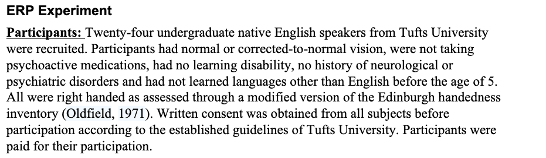

## Übersicht

-   Vorstellungsrunde
-   Informationen zum Kurs
-   Übersicht und Leistungsnachweise
-   Einführung ins Thema

## Ziele von heute sind, dass ...

::: incremental
-   wir uns kennenlernen
-   Sie einen Überblick über den Verlauf des Kurses und die Anforderungen haben
-   wissen, was wir in der Psycholinguistik erforschen und
-   ... mit was wir uns hier spezifisch im Seminar befassen werden
:::

## Vorstellungsrunde

-   Name & wie Sie angesprochen werden wollen
-   Studiengang
-   Grund für die Wahl des Kurses
-   Sprachen, die Sie sprechen, oder die Sie gerne lernen würden

## Allgemeine Informationen

-   Donnerstag, 14:00-15:30, Seminarraum rechts
-   Keine Sprechstunde, kontaktieren Sie mich per Email
-   Folien und Seminar auf Deutsch, Lektüre vorwiegend auf Englisch
-   Seminar im SM1:
    -   Kontaktzeit: 30h
    -   Selbststudium: 60h

------------------------------------------------------------------------

## Form des Seminars

-   hauptsächlich Lesen und Diskutieren von Artikeln aus Fachzeitschriften
-   d.h. wenig Frontalunterricht

## Frage an Sie

**Was wünschen Sie sich für eine angenehme und produktive Zusammenarbeit?**


## Was ich von Ihnen erwarte

:::: r-fit-text
::: incremental
-   respektvollen Umgang, es ist mir wichtig, dass alle sich wohl fühlen
-   Unterschiede und Diversität werden als Gewinn und nicht als Nachteil betrachtet
-   Trauen Sie sich Fragen zu stellen, Ihre Meinung zu äußern und Gedanken zu teilen. Es gibt keine "doofen" Fragen & Kommentare
-   Rückmeldungen, Ideen und Anregungen Ihrerseits sind erwünscht
-   Dieses Seminar ist abhängig von Ihrer Anwesenheit und aktiven Mitarbeit. Ihre Anwesenheit in den Sitzungen wird deshalb erwartet.
    -   bei Abwesenheit, melden Sie sich bitte vorab bei mir
-   Falls Sie eine Sitzung verpassen, informieren Sie sich bei Ihren Kommiliton:innen, nicht alle Informationen können auf den Folien gefunden werden
:::
::::


## Leistungsnachweise\*

::::::::: columns
::::: {.column width="50%"}
[**Leistungsnachweis A**]{style="color: #58226bce;"}

:::: r-fit-text
::: incremental
-   "Social Annotating": Artikel lesen und Fragen/Diskussionspunkte vor der Sitzung online auf *Perusall* teilen/annotieren, auf andere Kommentare Bezug nehmen und andere Fragen beantworten
-   für den Leistungsnachweis: 5/6 Beiträge sind obligatorisch
:::
::::
:::::

::::: {.column width="50%"}
[**Leistungsnachweis B**]{style="color: #58226bce;"}

:::: r-fit-text
::: incremental
-   kleine Projektarbeit in Gruppen oder alleine
-   Vorstellen am Ende des Semesters
-   Inhalt: Übertragen einer Studie in eine andere Sprache
:::
::::
:::::
:::::::::

::: aside
\*für die aktive Teilnahme
:::

## Organisatorisches

:::{.r-fit-text}

- Wir verwenden in diesem Kurs [**kein Illias**]{style="color: #8b093bf6;"}
- E-Mail-Liste
- Semesterplan und Folien auf öffentlicher Webseite: https://evvahu.github.io/SS2026_SM1/main.html
    - Ihre Namen & Daten werden da nie erwähnt
- Lektüre und Annotationen auf Perusall 
    - nach diesem Seminar schicke ich Ihnen einen Link + Passwort mit dem Sie dem Perusall-Kurs beitreten können
    - falls Probleme auftreten, bitte bei mir melden

:::

## Einführung 

**Mit was beschäftigen wir uns in der Psycholinguistik?**

-   kognitive Vorgänge und Zustände des sprachlichen Wissens
-   Spracherwerb
-   Sprachproduktion
-   Sprachverstehen
-   Sprachstörungen

[[@dietrich2017]{style="color: #22636bfa;font-size: 70%"}]{.absolute bottom=0 left=0}

------------------------------------------------------------------------

### Kognitive Vorgänge ("Mechanismen") und Zustände des sprachlichen Wissens

Was sind die Komponenten des sprachlichen Wissens?

:::{.r-fit-text}

::: incremental
-   lexikalische Wissen
-   grammatischen Kombinatorik (oder einfach nur "Grammatik")
-   (Pragmatik, soziolinguistisches Wissen)
:::

Was sind mögliche Prozeduren, Mechanismen?

::: incremental


- Abrufen von sprachlichem Wissen (Wörtern, syntaktische Form etc.)
- Vorhersagen von nachfolgenden Wörtern & Integration von bereits gehörten Wörtern
- ...

:::
:::
[[@dietrich2017]{style="color: #22636bfa;font-size: 70%"}]{.absolute bottom=0 left=0}

::: notes
kognitive Vorgänge und Zustände des sprachlichen Wissens: Sprachfähigkeit des Menschen beruht auf dem Zusammenwirken mehrerer Wissensbestände und Verarbeitungssysteme

lexikalische Wissen: Bedeutung, syntaktische Eigenschaften, Morphologie ("innerer Aufbau"), Ausdrucksseite

grammatische Kombinatorik: prozedurales Wissen um das Zusammenpassen sprachlicher Einheiten unter strukturellen Bedingungen
:::

------------------------------------------------------------------------

[**Sprachfähigkeit**: Wechselwirkung zwischen Sprachwissen und Sprachvorgängen]{style="font-size:150%;"}

[@dietrich2017]{style="color: #22636bfa;font-size: 70%"}

------------------------------------------------------------------------

### Spracherwerb

**Wie wird das sprachliche Wissen und die Sprachvorgänge erworben? Wie entwickeln sie sich?**

[Beispiele?]{style="color: #58226bce;"}

::: r-fit-text

::: incremental
-   Wie werden Wörter und deren Bedeutungen gelernt?
-   Wie werden die Regeln gelernt, wie Wörter geformt und kombiniert werden?
-   Wie werden (komplexe) Satzstrukturen gelernt?
-   Wie versteht ein Kind Sätze? Wie lernt es Sätze zu verarbeiten?
-   ...
:::

:::
------------------------------------------------------------------------

### Sprachproduktion

[**Was sind die kognitive Prozesse die der Sprachproduktion unterliegen?**]{style="font-size: 80%;"}

{width="660"}

::: notes
- Conceptualizer: Intention und Message werden geformt
    - kommunikatives Ziel (macro)
    - wie Information strukturiert wird (micro)
    - output: "preverbal message"
- Formulator: Message wird zu einem linguistischen "Plan" übersetzt (grammatische und phonetische Form)
    - grammatical encoding: Wörter finden
        - Lemmatas und Formen
        - Syntaktische Struktur
    -  phonetische Form wird abgerufen, übergeben an den Articulator
- Articulator: der "Plan" wird physisch artikuliert
    - Neuronale Signale zu Muskeln (Lunge, Zunge, Kehlkopf)
    - 
- Monitoring:
    - wir überprüfen unsere Äußerungen stets
    - intern und extern

:::

----

### Sprachproduktion

[**Was sind die kognitive Prozesse die der Sprachproduktion unterliegen?**]{style="font-size: 80%;"}

{width="660"}


[Was fehlt hier?]{style="color: #940d3fe3;"}


----

### Sprachverstehen

[**Wie funktioniert das Sprachverstehen?**]{style="font-size: 80%;"}

{width="660"}

::: notes

- Lauterkennung, entnehmen der Lautform des akustischen Ereignisses
- segmentiert werden
- kategoriale Wahrnehmung
- Worterkennung
- die Wörter müssen geparst werden, der syntaktische Aufbau, Verstehen wie Wört zusammenhängen
- prosodisches Wissen
- pragmatisches Wissen
- Weltwissen

:::

----


### Sprachverstehen

Heute

----

### Sprachverstehen

Heute 

----

### Sprachverstehen

Heute früh

----

### Sprachverstehen

Heute früh habe

----

### Sprachverstehen

Heute früh habe ich

----

### Sprachverstehen

Heute früh habe ich sehr

----

### Sprachverstehen

Heute früh habe ich sehr gut

----

### Sprachverstehen

Heute früh habe ich sehr gut gefrühstückt

----

### Sprachverstehen

Heute früh habe ich sehr gut [jongliert]{style="color: #de0ead8d;"}

----

### Sprachverstehen

Heute früh habe ich sehr gut [\*gerannt]{style="color: #ba0f23fc;"}

----


### Sprachverstehen

- gesprochene Sprache ist flüchtig -> schnelle & **inkrementelle** Verarbeitung
- Integration des vorherigen Inputs und Vorhersagen des nachfolgenden Inputs


---


### Sprachstörungen

**Was für Sprachstörungen kennen Sie?**

::: incremental

- Sprechhpraxie: betrifft die phonetisch-phonologische Produktion
- Broca-Aphasie: Störung der syntaktischen Verarbeitung (Produktion & Rezeption)
- Wernicke-Aphasie: Störung der lexikalischen Verarbeitung (Produktion & Rezeption)
- Sprachentwicklungsstörungen, z.B. im Lauterwerb oder Wortschatzerweiterung

:::

[[@dietrich2017]{style="color: #22636bfa;font-size: 70%"}]{.absolute bottom=0 left=0}

::: notes


:::

--- 

### Fokus von diesem Seminare


-   Einfluss von verschiedenen Sprachen
-   Verarbeitung (v.a. Verstehen) von Morphosyntax auf der Satzebene 
-   sowohl von Kindern und Erwachsenen
    - wie unterscheiden sich Kinder von Erwachsenen? Welche sprachspezifischen Muster sind schon bei Kinder ersichtlich? Welche nicht? Welche gehen verloren?

------------------ 


### Beispiele


```{r}

glossr::as_gloss(
    "Minik tavşan birazdan yiyecek şuradaki havuçu.",
  "Minik tavşan birazdan yi-yecek şura-da-ki havuç-u.",
  "little rabit soon eat-FUT there-Loc-Rel carrot-Acc",
  translation = "The little rabbit will soon eat the carrot over there",
  label = "my-label",
  source = "Turkish (Özge et al. 2019, example 6)"
)

```

------------------ 

### Beispiele

```{r}
glossr::as_gloss(
  "Kakainin ng maliit na kuneho ang karot diyan mamaya",
  "Ka~kain-in ng maliit na kuneho ang karot diyan mamaya",
  "IPFV~eat-PV GEN small LK rabbit NOM carrot over_there soon",
  translation = "The little rabbit will soon eat the carrot over there",
  label = "my-label2",
  source = "Tagalog (mein Beispiel)"
)

```


## Nächstes Mal




## Nächstes Mal


**Wieso ist es essentiell, dass wir nicht nur Daten von einer solchen Sprechergruppe haben?**

In diesem Seminar: Fokus auf Sprachdiversität (ebenso wichtig: Neurodiversität, kulturelle Diversität, unterschiedliche Hintergründe, etc.)


## Semesterplan: thematischer Aufbau {.scrollable}

- Sitzung 2: Sprachdiversität in der Psycholinguistik
    - Wieso ist es wichtig unterschiedliche Sprachen zu erforschen, um zu wissen, wie Menschen Sprache allgemein verarbeiten?
- Sitzung 3 und 4: Competition Model, Fokus auf sprachbedingte Unterschiede in der Sprachverarbeitung 
    - Competition Model: eine Theorie, die die Auswirkungen von Sprachunterschieden auf die Sprachverarbeitung eklärt (oder versucht zu erklären)
- Sitzung  5 und 6: Agens Präferenz, eine universelle Verarbeitungsstrategie?
- Sitzung 7: sprachbedingte Unterschiede von Verarbeitung komplexer Sätze
- Sitzung 8: Sprachproduktion & Satzplanung (?)


# Referenzen

::: {#refs}
:::