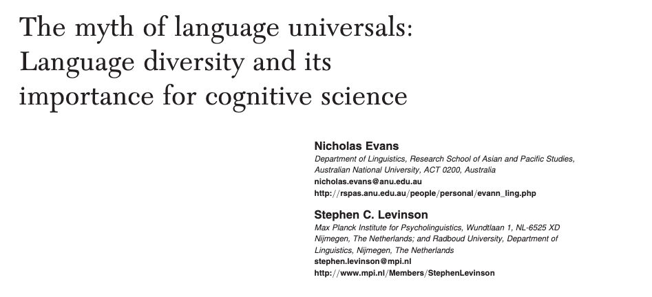
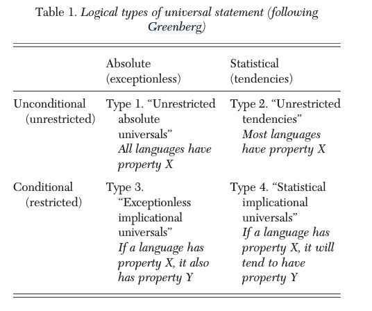

## Umfrage: KI-Nutzung

{width="528" height="NaN"}

## Rückblick letzte Woche

- Was sind die Komponenten des sprachlichen Wissens? Was sind die Mechanismen/Vorgänge?
  - Sprachfähigkeit: sprachliches Wissen + Vorgänge
- **Spracherwerb**, **Sprachverstehen**, Sprachproduktion, Sprachstörungen
- Verstehen gesprochener Sprache ist inkrementell
- diverse Stichproben sind wichtig, in diesem Seminar konzentrieren wir uns auf Sprachdiversität

------------------------------------------------------------------------

"like linguists before them, psycholinguists have gradually come to realize that, if they are to make universal claims, in this case about language processing mechanisms, they should not restrict themselves to the study of English."[p. 1137, @garnham1994]

[--\> Heute werden wir genauer besprechen, wieso wir uns in der Psycholinguistik nicht auf einige wenige Sprachen beschränken sollten.]{style="color: #300472fa;"}

## Heute

- Einführung: Universalien und Universal Grammar
- @norcliffeCrosslinguisticPsycholinguisticsIts2015
- (jetztiger Stand der Sprachdiversität in der Psycholinguistik)

## Generative Grammatik und Universal Grammar

- Universal Grammar: beinhaltet grammatische Prinzipien, die komplex und implizit sind und vom Input nicht erlernbar sind
  - Prinzipien = angeboren & unterliegen allen Sprachen
- Sprachunterschiede = "Surface Differences" denen ein gemeinsames Sprachsystem unterliegt

[[gute Einführung zu Theorien des Spracherwerbs: @ambridgechild2011]{style="color: #22636bfa;font-size: 70%"}]{.absolute bottom=0 left=0}

------------------------------------------------------------------------

### Sprachuniversalien

["In fact, there are vanishingly few universals of language in the direct sense that all languages exhibit them. Instead, diversity can be found at almost every level of linguistic organization. This fundamentally changes the object of enquiry from a cognitive science perspective." [@evansMythLanguageUniversals2009, abstract]]{style="font-size: 80%"}

{width="600" height="NaN"}

------------------------------------------------------------------------

### Sprachuniversalien [@greenberg1963some]

::::::::: columns
::::: {.column width="50%"}
{width="528" height="NaN"}
:::::
::::::::: 

::: notes
Was sind das für Sprachuniversalien? Beispiele
unconditional&absolute: all languages have vowels
conditional&absolute: Wenn eine Sprache einen Dual hat, dann hat sie auch einen Plural.
unconditional&statistical: most languages make a distinction between nouns and verbs
conditional&statistical: Wenn die Grundwortstellung in einer Sprache Patiens-Verb ist, dann hat sie meistens Postpositionen.
:::

------------------------------------------------------------------------

### Sprachuniversalien [@greenberg1963some]

::::::::: columns
::::: {.column width="50%"}
{width="528" height="NaN"}
:::::
::::: {.column width="50%"}
- [Subject?]{style="color: #9a1414fa;"}
- [Constituency?]{style="color: #9a1414fa;"}
- [Recursion?]{style="color: #9a1414fa;"}

--\> die meisten "Universalien" sind Tendenzen
:::::
::::::::: 

------------------------------------------------------------------------

### Fragen

- Wie finden wir (statistische) Universalien?
- Wieso gibt es statistische Universalien?

::: notes
Sprachfamilie Sprachgebiet key organisational features kulturelle Aspekte Modalität (z.B. geschriebene Sprache oder nicht) Qualität der Sprachbeschreibungen
key organisational features die sich bedingen: kasusmarkierte Sprache = freie Worstellung, dominant phrase orders (siehe LAII)
wieso gibt es sie? kognitive, kulturelle, kontext/umwelt, transmission, modalität, evolutionsbedingt
:::

------------------------------------------------------------------------

### Zusammenhang zwischen Spracheigenschaften und Sprachverarbeitung

:::: r-fit-text

- [**Wichtig**]{style="color: #9a1414fa;"}: Sprachunterschiede/-gemeinsamkeiten führen nicht unbedingt zu unterschiedlicher/ähnlicher Sprachverarbeitung 
- Sprachunterschiede/-gemeinsamkeiten wichtig um zu erforschen, ...
  - wie die Sprache die Sprachverarbeitung beeinflusst
    - [siehe Woche 3 und 4]{style="color: #810fdefa;"}: Competition Model
  - ob es "universelle" Muster in der Sprachverarbeitung gibt und wieso
    - [siehe Woche 5 und 6]{style="color: #8513e3fa;"}: Agens Präferenz
    
::::

------------------------------------------------------------------------

["A full description of the language faculty requires uncovering both the universal characteristics of the language system and the modulations imposed by language specific properties."[@costa2012]]{style="color: #22636bfa;"}

------------------------------------------------------------------------

## @norcliffeCrosslinguisticPsycholinguisticsIts2015

(0. Intro)

1.  History
    i)  Child language acquisition
    ii) Adult language processing
2.  Two case studies
    i)  Syntactic complexity and comprehension difficulty
    ii) Incrementality and the time-course of sentence formulation

(3. The papers in this issue)

::: notes
viel Inhalt/Informationen
Fragen beantwortne, die wichtigsten Punkte für uns herausarbeiten
in Gruppen und im Plenum
Motivation der Special Issue
:::

------------------------------------------------------------------------

### Geschichte

- Wie unterscheidet sich die Geschichte der beiden Forschungsschwerpunkte (Erstspracherwerb und Sprachverarbeitung bei Erwachsenen)? 
- Wieso?

::: notes

- FLA:
- LP: was sind die Unterschiede zwischen den drei Modellen? Wieso werden syntaktische Ambiguitäten benutzt um Vorgänge zu untersuchen?
"parsing universals were no longer taken as an unquestioned theoretical assumption, but rather as a hypothesis to test empirically on the basis of cross-linguistic data."

:::
------------------------------------------------------------------------

### Fallstudien

- Wie hat die Untersuchung von unterschiedlichen Sprachen dazu beigetragen, ein besseres Verständnis über die Verarbeitung von Relativsätzen (1) und die Planung von Sätzen (2) zu erlangen?
- Sprachen und deren strukturelle Eigenschaften
- Theorien & Hypothesen
  - Inwiefern bestätigen oder widerlegen Studien zu "Nicht-Englisch" diese Theorien?

------------------------------------------------------------------------

# Referenzen

::: {#refs}
:::