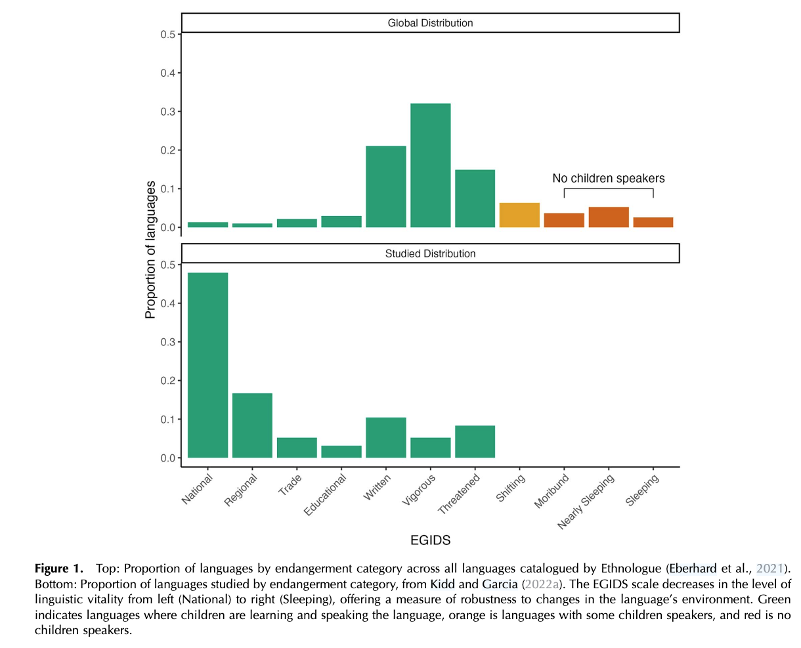
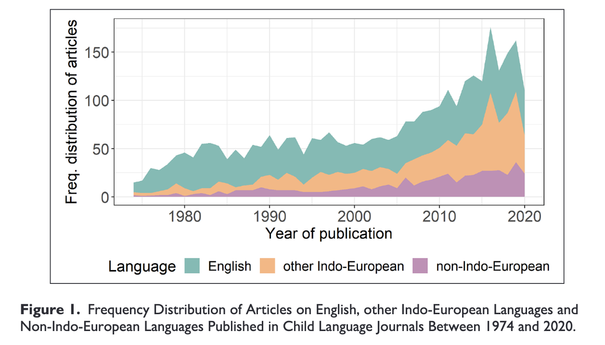
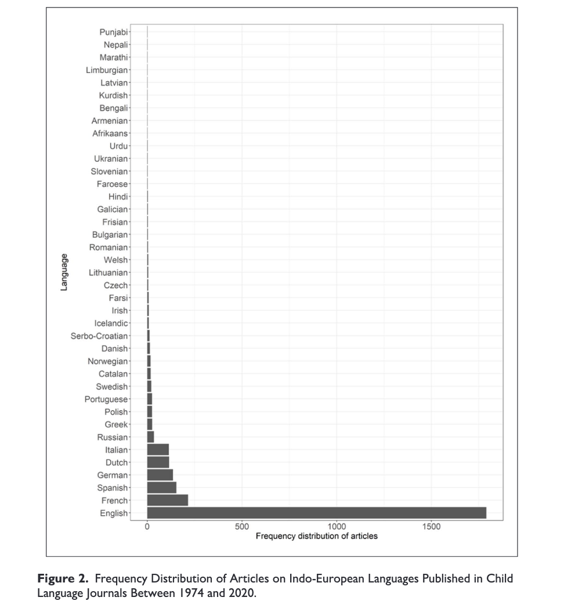

-----------------------------------------------------------------------

## Was haben wir letztes Mal besprochen?

::: notes
(1) by empirical testing postulated general (universal) properties of processing (see, for instance, the research on relative clause attachment, summarised above) and (2) by pointing to gaps in our theoretical coverage and exploring unknown territory.
universal and distinct properties

:::

## Wo stehen wir heute? (Erstspracherwerb)

**Bedrohte Sprachen**

"A comprehensive theory of any language phenomenon requires a representative sample that provides a solid foundation for theory building, and an even bigger sample for theory testing. As more and more languages disappear, we rapidly lose opportunities to better understand our object of study."[@passmore2025]

--------

{width="NaN" height=600}

[@passmore2025]{style="font-size: 70%;"}

--------

**Sprachdiversität**

[@kiddhow2022]{style="font-size: 70%;"}

----

**Sprachdiversität**

{width="NaN" height=600}     [@kiddhow2022]{style="font-size: 70%;"}

## Heute: *Competition Model*

- Was sagt die Theorie genau aus?
- Wie ermöglicht die Theorie, die Sprachverarbeitung von unterschiedlichen Sprachen besser zu verstehen/zu modellieren?

## Nächste Woche

- *Competition Model* im Bezug auf Erstspracherwerb

# Referenzen

::: {#refs}
:::