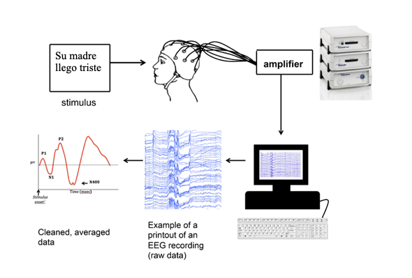
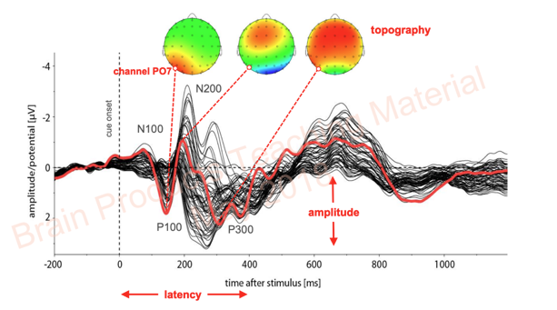

-----------------------------------------------------------------------

## Was haben wir letztes Mal besprochen?

**Competition Model**

- Was sind die wichtigen Cues für Semantische Rollen (oder 'who does what to whom')?
- Welche wurden in @macwhinney1984 untersucht? 
- Wie unterscheiden sich Kinder von Erwachsenen, wie sie diese Cues anwenden?

## @chan2009

- Wie wurde *Cue Availability*, *Reliability* und *Validity* gemessen? (jeweils von Worstellung und Belebtheit)
- Was sind die wichtigen Unterschiede zwischen Englisch, Deutsch und Kantonesisch im Bezug auf diese zwei Cues?
- Wieso benutzen @chan2009 Pseudo-Verben in ihren Experimenten?

## @chan2009

Resultate und Diskussion:

- Was zeigen die Resultate im Bezug auf die verschiedenen Altersgruppen und die verschiedenen Sprachen und die verschiedenen Konditionen?
- Wie interpretieren die Autor:innen die Resultate?

## Einführung zu EEG (Elektroenzephalografie)
::: {style="font-size: 70%;"}
- nimmt die elektrische Aktivität im Hirn durch die Platizerung von Elektroden auf der Kopfoberfläche auf
    - Aktivität von Neuronen, die zur selben Zeit aktiviert werden. 
- hohe zeitliche Auflösung (Millisekunden) -> ideal um Veränderungen in der neuronalen Dynamik zu untersuchen
- schlechte räumliche Auflösung -> schwierig den exakten Ort der Aktivität zu erkennen
- Elektroenzephalogramm: graphische Darstellung von Schwankungen in der elektrischen Aktivität
:::
::: notes

- gesäubert, Artefakte entfernt
- gefiltert (nur gewisse Frequenzen zwischen Min und Max-Wert)
- epoching/segmenting (mark where events )
- baseline correction
- average trial per subject
- average trial over subject

:::
-----

[from @beres2017]{style="font-size: 70%;"}

::: notes

- Messverstärker wird benötigt um das Signal zu verstärken (Kopfhaut zu messenden Signale: 5 bis 100 µV)
- 

:::

-----

### Verarbeitung, Analyse von EEG-Daten

- Trials von der selben Kondition werden zusammengerechnet, gemittelt
- Resultat: ERPs (**E**vent **R**elated **P**otentials)
    - Aktivität, die in Verbindung mit einem bestimmten Ereignis auftritt
    - Ereignis: relevanter Zeitpunkt in einem Experiment (z.B. Anfang von einem Wort)

-----

### Eigenschaften von ERPs

Latenz, Polarität, Topographie und Amplitude

-----

### Komponenten  
::::::::: columns
::::: {.column width="40%"} 
::: {style="font-size: 70%;"}
-  **N400**: 
    - Latenz: 300-500ms
    - Polarität: negativ, *centro-parietal*
    - korreliert mit: semantischer Integration, Angemessenheit des Wortes im Kontext
    - Interpretation: je unerwarteter/unpassender das Wort, desto größer der N400-Effekt
:::
:::::
::::: {.column width="60%"}

![[from @steinhauer2014]{style="font-size: 70%;"}](images/EEG_N400.jpg)

:::::
::::::::: 
-----

### Komponenten 

::::::::: columns
::::: {.column width="40%"}
- **LAN** (left anterior negativity): 
    - Latenz: 300-500ms
    - Polarität: negativ, anterior links
    - korreliert mit: Verarbeitung von Morphosyntax und Kongruenz
:::::
::::: {.column width="60%"}
![[from @faulhaber2014]{style="font-size: 70%;"}](images/EEG_topo.jpg){width=200}
:::::
::::::::: 

-----

### Komponenten 
::::::::: columns
::::: {.column width="40%"} 
::: {style="font-size: 70%;"}

-  **P600**: 
    - Latenz: 500-900 ms
    - Polarität: positiv, posterior
    - korreliert mit: Reanalyse, "syntactic Repair"
:::
:::::
::::: {.column width="60%"}

![[from @chunyutse2007]{style="font-size: 70%;"}](images/EEG_P600.jpg)

:::::
::::::::: 

## Ankündigung CCLS 

- Präsentation von Arrate Isasi-Isasmendi: "Argument role processing in bilingual children: competing cues across languages"
- Datum und Zeit: 18.5.2026, 16-17:30
- Wo: Hörsaal VIII im Hauptgebäude

# Referenzen

::: {#refs}
:::