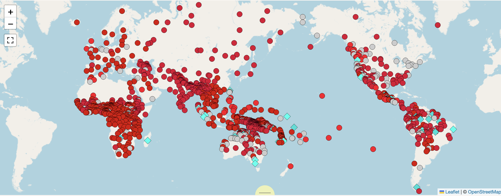
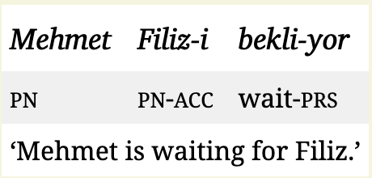
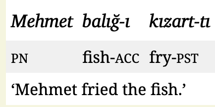
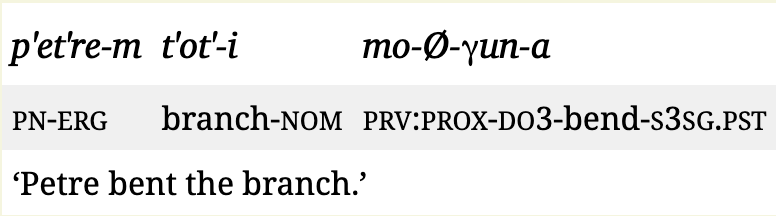
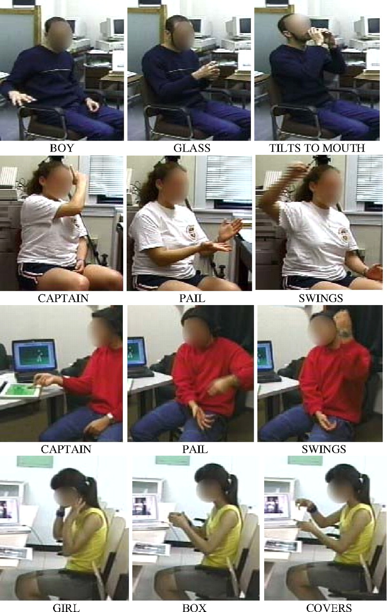
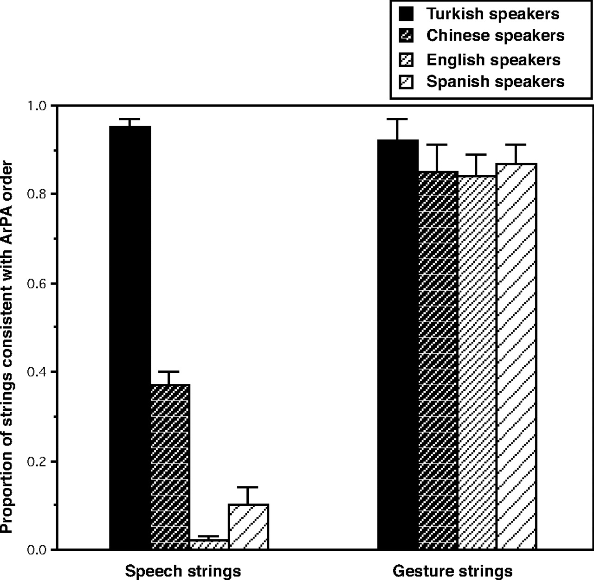
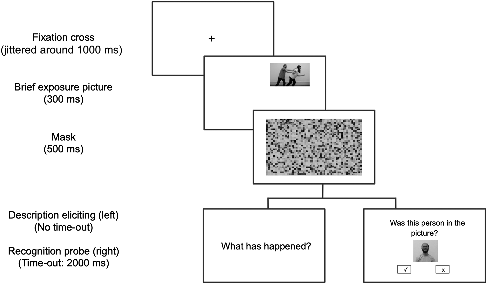
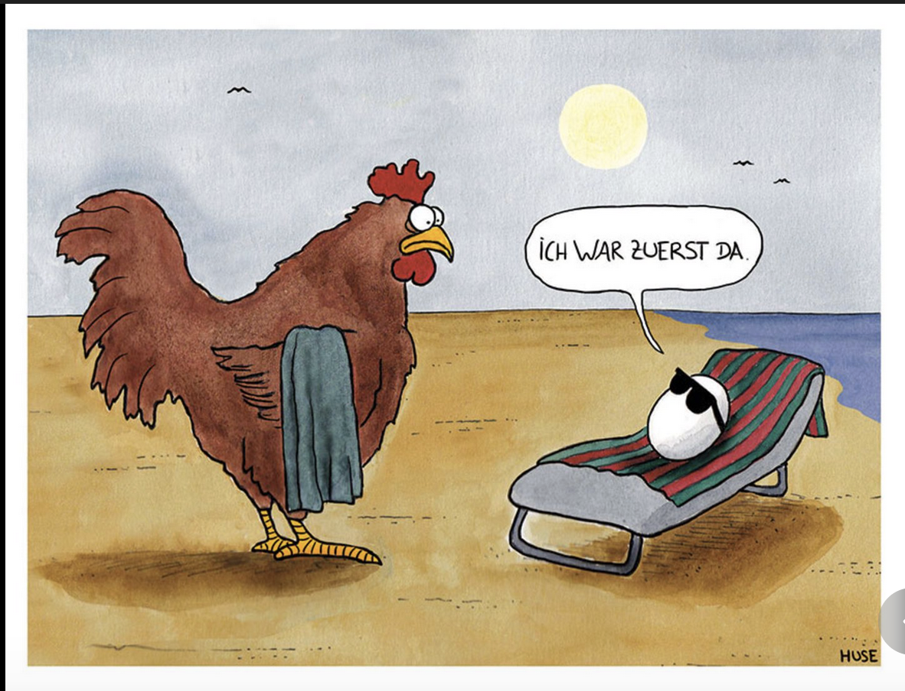
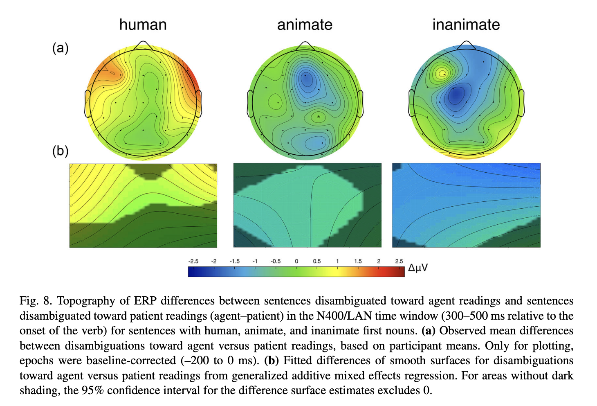

------------------------------------------------------------------------

## Was haben wir letztes Mal besprochen?

**Competition Model II**

::: {style="font-size: 90%;"}
- Wie unterscheiden sich Cues und deren Gewichtung in unterschiedlichen Sprachen?
  - @macwhinney1984: Worstellung, Kongruenz, Betonung
- Was sind die Auswirkungen dieser Unterschiede auf den Erstspracherwerb?
  - @chan2009: Unterschiede in Worstellungen und Auslassen von Argumenten
:::

Heute: von Unterschieden zu **Gemeinsamkeiten**

[**Agent Preference**]{style="color: #530c6aea;"} = universelles Merkmal der Sprachverarbeitung?

## Unterschiede zu Studien in Wochen 2 und 3

Heute: EEG und nächstes Mal: Eye-Tracking

Frage:

- [Wie unterscheiden sich diese Methoden von den Methoden in @macwhinney1984 und @chan2009?]{style="color: #530c6aea;"}

::: {style="font-size: 80%;"}
Zur Erinnerung:

- @macwhinney1984: Teilnehmende hörten Sätze und mussten im Anschluss das Agens nennen
- @chan2009: *Act-out*-Experiment, Teilnehmende spielen, was sie gehört haben, mit Puppen nach
:::

## Was ist die *Agens Präferenz*?

In gesprochenen Sprachen und Gebärdensprachen?

## Was ist die *Agens Präferenz*?

In gesprochenen Sprachen und Gebärdensprachen?

**Wortstellung** ([Subject-before-Object]{style="color: #cf1029ea; font-size: 80%; "} [Object-before-Subject]{style="color: #12b0d8ea; font-size: 80%; "})

auch in Gebärdensprachen (siehe @napoli2014)

## Was ist die *Agens Präferenz*?

In gesprochenen Sprachen und Gebärdensprachen?

**Kasusmarkierung**

::::: columns
::: {.column width="50%"}

:::

::: {.column width="50%"}

:::
:::::

[Aber...?]{style="color: #8c0e1fea; "}

## Was ist die *Agens Präferenz*?

[**Ergativsprachen!**]{style="color: #8c0e1fea; "}

aber laut @bickel2015 sind Nominativ-Akkusativ-Sprachen in der Evolution von Sprachen bevorzugt

## Was ist die *Agens Präferenz*?

Evidenz von Gesten (z.B. @goldinm2008)

## Was ist die *Agens Präferenz*?

Evidenz von Gesten (z.B. @goldinm2008)

[Präferenz der Abfolge: Agens-Patiens-Aktion]{style="font-size: 80%; "}

## Was ist die *Agens Präferenz*?

Event Cognition (z.B. @isasi-isasmendi2023)

## Was ist die *Agens Präferenz*?

Event Cognition (z.B. @isasi-isasmendi2023)

## *Agens Präferenz*

**Ein Henne-Ei-Problem?**

(Von [stern.de 'Na endlich: Forscher wollen das Henne-Ei-Problem gelöst haben'](https://www.stern.de/panorama/wissen/henne-ei-problem--forscher-wollen-antwort-auf-uralte-frage-haben-35242636.html))

## Fragen (in Gruppen)

1.  Wie versucht diese Studie dieses *Henne-Ei-Problem* anhand von Äiwoo zu lösen?
2. Was sind die Hypothesen? (siehe *Table 1*)
3.  Wie ist das Experiment aufgebaut?
4.  Was sind die Resultate ...

- ... bezüglich Belebtheit, Menschlichkeit und Unbelebtheit in transitiven Sätzen?
- ... bezüglich transitiven vs. intransitiven Sätzen?

5.  Wie werden die Ergebnisse der transitiven Sätzen interpretiert?
6.  Könnten die Ergebnisse auch anders interpretiert werden? Gibt es Kritik an dem Experimentdesign?

## Resultate @sauppe2022

## Themen zu den Sitzungen 7 und 8

- Sitzung 6: Agens Präferenz bei Kindern
- Für Sitzungen 7 und 8:
  - Sprachproduktion & Satzplanung?
  - Relativsätze oder Passiv?
  - Bi-/Multilingualismus?
  - ...?

# Referenzen

::: {#refs}
:::