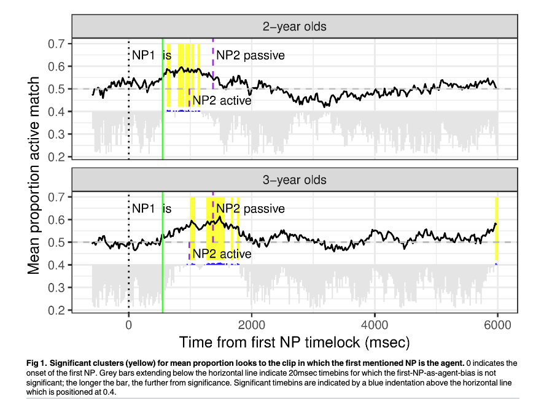
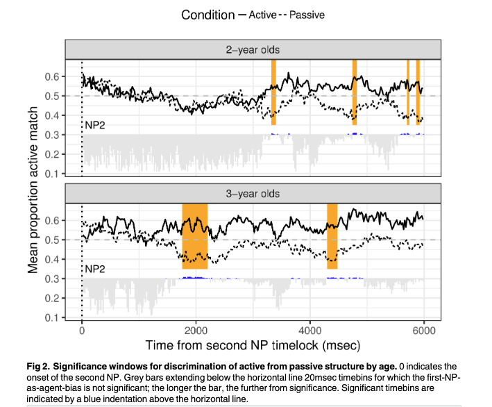
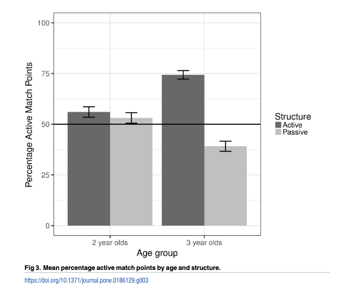
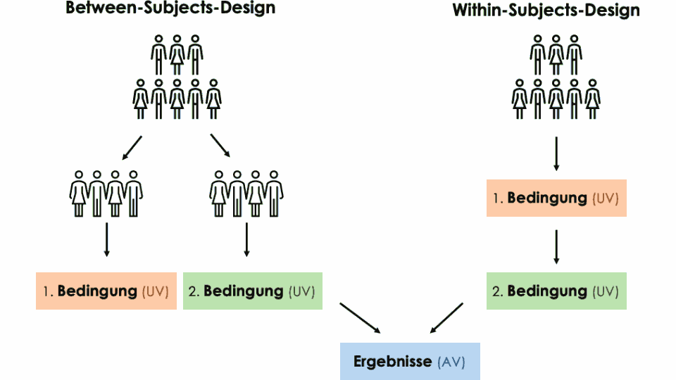
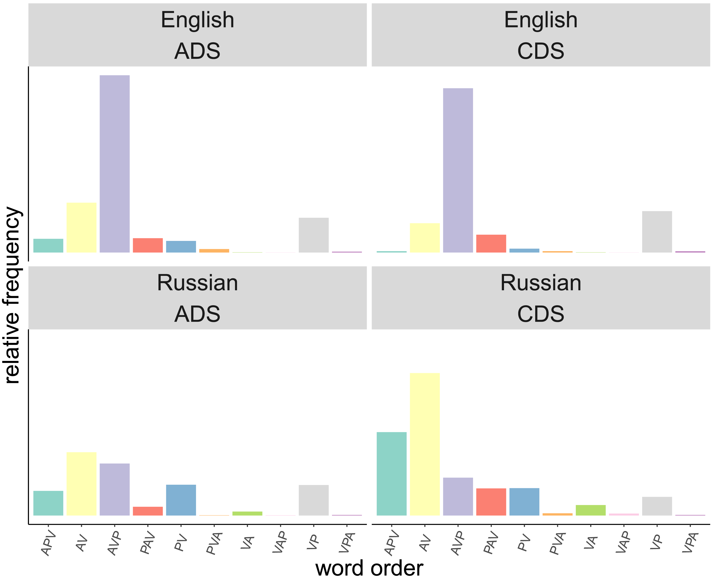

------------------------------------------------------------------------

## Was haben wir letztes Mal besprochen?

**Agens Präferenz** [@sauppe2022]

- Ist die Agens Präferenz ein Produkt unserer Erfahrung mit häufigen Strukturen in der Sprache? oder ist sie alternativ verwurzelt in allgemeine kognitive Faktoren?
- Äiwoo, patiens-initiale Sprache, Worstellung im Sprachgebrauch ist mit einer Agens Präferenz im Konflikt
- Resultate: Präferenz für Agens nur bei menschlichen Referenten, bei anderen belebten und unbelebten Referenten gibt es eine Präferenz für Patiens

[Heute: Agens Präferenz im kindlichen Spracherwerb]{style="color: #3b0767ea; "}

## @abbot-smith2017

[Do two and three year old children use an incremental first-NP-as-agent bias to process active transitive and passive sentences?: A permutation analysis]{style="color: #3b0767ea; "}

Was sind die **zwei Forschungsfragen**, die die Autor\*innen versuchen zu beantworten?

------------------------------------------------------------------------

### Methode

- Between-Subjects-Design vs. Within-Subjects-Design: welches Design verwendet diese Studie? Wieso?
- offline vs. online experimentelle Paradigma: in Anbetracht der Forschungsfragen, wieso verwendet die Studie beide Paradigma?
- Eye-Tracking und forced-choice Pointing: Wie funktionieren diese experimentellen Paradigma?
- Ablauf des Experimentes: Wie laufen die Experimente ab?

------------------------------------------------------------------------

### Resultate

Was zeigen die Resultate und welche Forschungsfrage beantworten sie?

------------------------------------------------------------------------

### Experiment 1 (eye-tracking)

{width="1000"}

------------------------------------------------------------------------

### Experiment 1 (eye-tracking)

{width="1000"}

------------------------------------------------------------------------

### Experiment 2 (forced-choice)

{width="1500"}

------------------------------------------------------------------------

### Diskussion

- Wie sind die Ergebnisse von @abbot-smith2017 mit denen von @sauppe2022 zu vergleichen?
- Würden wir die gleichen Ergebnisse bei Kindern, die eine andere Sprache lernen, sehen?
- Was findet ihr besonders überzeugend oder eher weniger überzeugend an der Studie (im Bezug auf die Methode, Resultate und deren Interpretation)?

## Studienleistung B

Ihr plant eure eigene Studie!

- Ihr wählt einen Artikel
  - entweder einen aus der [Liste](literaturliste.html) oder ihr sucht selber einen 
  - Inhalt muss den Themen, die wir hier besprochen haben, entsprechen (experimentelle Studie zur Verarbeitung/Erwerb von Morphosyntax))
- Ihr adaptiert die Studie in eine andere Sprache

------------------------------------------------------------------------

### Studienleistung B

**Gruppen**:

- zu zweit (oder alleine)

**Daten**:

- bis **18.06 um 12:00**: schickt mir eure Wahl des Artikels (falls es eines von der Liste ist, bitte mit einer Alternative) + etwaige Abwesenheiten in Sitzungen 10-12
- während dem Seminar am 02.07: individuelles Arbeiten an der Studienleistung
- Besprechen eurer Artikel und Studienleistungen: Sitzungen 10-12 (09.07 / 16.07 / 23.07)

Sprachstunden: nach Vereinbarung

------------------------------------------------------------------------

### Sitzungen 10-12

- Jede\*r liest mindestens einer der Artikel
  - ich stelle die Artikel auf Perusall aber das Kommentieren ist nicht mehr Teil der Studienleistungen
- Ihr seid die Experten aber wir besprechen eure Artikel zusammen
- Im Anschluss stellt ihr eure Studie mit Hilfe von einem Handout, kleinen Poster oder wenigen (!) Folien vor
- Fragen & Diskussion

------------------------------------------------------------------------

### "Eure" Studie

- Unterschiede zwischen Zielsprache und der Originalsprache (nur bezüglich der relevanten Eigenschaften)
- Methode: die gleiche oder eine andere?
- Beschreibt die Sprache
  - ... im Bezug auf Ihre Grammatik (wieder: nur relevante Aspekte)
  - ... im Bezug auf den Sprachgebrauch (Häufigkeiten unterschiedlicher Eigenschaften/Strukturen) (wenn möglich)
- Wählt eure Bedingung(en) aus und veranschaulicht sie anhand von einem **Item** auf (keine Liste von allen Stimuli erforderlich)
- Aufgrund der Spracheigenschaften und des Sprachgebrauchs: Was sind eure Hypothesen/Erwartungen? Wie denkt ihr werden die Ergebnisse eurer Studie im Vergleich zu der Originalstudie aussehen?

------------------------------------------------------------------------

### "Eure" Studie

- Im Falle von Kindsspracherwerb: welches Alter? und wieso?
- Transfer von Erwachsene -\> Kinder ist ebenso möglich (die umgekehrte Richtung ist wahrscheinlich weniger spannend)
- Zielsprache darf Deutsch sein, wenn ihr eine andere Sprache wählt, konzentriert euch auf die relevanten Merkmale

**wichtig**: das Hauptziel dieser Studienleistung ist die vertiefte Auseinandersetzung mit dem Aufbau von Experimenten und dem Einfluss von unterschiedlichen Sprachen auf die Sprachverarbeitung und den Spracherwerb. Ebenso dient die Studienleistung als Grundlage für die Diskussion in der Sitzung. Ihr müsst **keine** perfekte, durchführbare Studie erstellen.

------------------------------------------------------------------------

### Experimentelles Design: Terminologie

- unabhängige Variable (**independent variable**)
  - manipulierte Variable(n) mit deren Hilfe man versucht, die abhängige Variable zu modellieren (i.e. man untersucht deren Auswirkung)
  - "Ursache"
- abhängige Variable (**dependent variable**)
  - das Ergebnis, was gemessen wird
  - "Antwortvariable"/"Wirkung"

Was sind die unabhängigen und abhängigen Variablen in @abbot-smith2017?

------------------------------------------------------------------------

### Experimentelles Design: Terminologie

::::::::: columns
::::: {.column width="50%"}

::: {style="font-size: 80%;"}

- Between-Subjects-Design:
  - Bedingung wird nicht von allen Versuchsgruppen gesehen
- Within-Subjects-Design:
  - Bedingung wird von allen Versuchsgruppen gesehen
- oftmals: gemischtes Design ("Mixed-Model-Design")

:::

:::::

::::: {.column width="50%"}

::: {style="font-size: 60%;"}
Illustration von [Link](https://systmus.blogs.uni-hamburg.de/between-subjects-design-vs-within-subjects-design/)
:::
::::

::::::::: 

------------------------------------------------------------------------

### Experimentelle Designs: Terminologie

- Item: Tuple (Trippel, Quadrupel,...) vom selben Stimulus in den unterschiedlichen Bedingungen
  - z.B. ein Item in zwei Bedingungen (Aktiv/Passiv): "The man washes the dog."(*Aktiv*) und "The dog is washed by the man." (*Passiv*)
- *Within-Items*: sind erwünscht aber nicht immer möglich (z.B. inhärente Eigenschaften von Wörtern wie Wordlänge)
- Minimalpaare: erwünscht um Störfaktoren zu vermeiden
- Störfaktoren:
  - Variable, die systematisch mit den unabhängigen und abhängigen Variblen korelliert und somit eine alternative Erklärung der Ergebnisse liefert
  - Ihr Effekt ist von dem Effekt der unabhängigen Varible nicht zu unterscheiden

::: notes
In an experiment examining surprisal effect, sentence length might be a confounding variable that is responsible for the relation between surprisal and reaction time (RT)
:::

## Beispiel

::: {style="font-size: 80%;"}
- Ausgangsstudie: @abbot-smith2017
  - 2 und 3-jährige Kinder zeigen einen (temporären) first-NP-as-agent Bias
  - nur 3-jährige interpretieren Passivsätze richtig
- Originalsprache: Englisch, Zielsprache: Russisch
- Motivation:
  - Wie im Englischen ist der Passiv in der gesprochenen Sprache im Russischen selten
  - Unterschiede zum Englischen: flexible Worstellung im Russischen, Kasus und stärker ausgeprägte Markierung von Kongruenz
- Forschungsfrage: Weisen russischsprechende Kinder first-NP-as-agent Bias in ihrer Satzverarbeitung auf?
- Manipulation von Reihenfolge der Semantischen Rollen durch Worstellung, nich durch Diathese
- Methode:
  - wird nicht geändert, da das Interesse in der Online-Verarbeitung sowie auch im Offline-Verständnis liegt
  - Alter: gleich wie in @abbot-smith2017
:::

------------------------------------------------------------------------

### Spracheigenschaften

- Worstellung: flexibel, alle sechs Worstellungen sind erlaubt, Worstellung hängt von Informationsstruktur ab @bailynDoesRussianScrambling2003
- Kasussystem:
  - Akkusativ-Nominatives Alignment
  - stark flektierend, \`\`fusional'' (Kasus, Numerus & Genus)
  - sechs Kasus (Nominativ, Akkusativ, Genitiv, Dativ, Instrumental, Lokativ)
  - Deklinationsklassen, Unterscheidung zwischen belebten und unbelebten Substantiven
- Kongruenz von Verb und Subjekt:
  - Numerus, Genus nur in der Vergangenheit

@timberlake2004reference

------------------------------------------------------------------------

### Sprachgebrauch: Worstellung

@huber2026

------------------------------------------------------------------------

### Studiendesign

- 2 x 2 Design (faktorieller Versuchsplan --\> testen von mehreren unabhängigen Variablen)
- Bedingungen:
  - Worstellung: AVP vs. PVA
  - Ambiguität von der ersten NP: ambig vs. nicht ambig (durch synkretische Kasusmarkierung)
- Stimuli:
  - NPs: belebt
    - Schwierigkeit: Synkretismus ist abhängig vom Nomen (Belebtheit, letzter Konsonant (hart oder weich))
  - Verben: transitive Verben mit Agens-Argumenten im Nominativ und Patiens-Argumenten im Akkusativ

------------------------------------------------------------------------

### Studiendesign: Item

::: {style="font-size: 70%;"}
| Wortstellung | Ambiguität 1. NP | Beispiel | Übersetzung |
|------------------|------------------|------------------|------------------|
| AVP | ambig | дочь ('daughter.NOM/ACC') видит (see-3SG) отца (father-ACC) | 'The daughter sees the father' |
| PVA | ambig | дочь ('daughter.NOM/ACC') видит (see-3SG) отец (father.NOM) | 'The father sees the daughter' |
| AVP | nicht ambig | мальчик ('son.NOM') видит (see-3SG) отца (father-ACC) | 'The son sees the father' |
| PVA | nicht ambig | мальчику ('son-ACC') видит (see-3SG) отец ('father.NOM') | 'The father sees the son' |
:::

------------------------------------------------------------------------

### Hypothese / Voraussage

::: {style="font-size: 70%;"}
| Worstellung | Ambiguität 1. NP | Voraussage ET | Voraussage FC |
|------------------|------------------|------------------|------------------|
| AVP | ambig | mehr Blicke zu AVP bereits vor dem Verb | niedrige Fehlerquote |
| PVA | ambig | mehr Blicke zu AVP bereits vor dem Verb; 2. NP: immer noch mehr Blicke zu AVP | hohe Fehlerquote |
| AVP | nicht ambig | mehr Blicke zu AVP bereits vor dem Verb | niedrige Fehlerquote |
| PVA | nicht ambig | mehr Blicke zu AVP bereits vor dem Verb; 2. NP: 2-Jährige: mehr Blicke zu AVP, 3-jährige: mehr Blicke zu PVA | 2-Jährige: hohe Fehlerquote (niedriger als bei PVA+ambig), 3-jährige (oberhalb des Zufallswert) |

: ET = Eye-Tracking, FC = Forced Choice
:::

------------------------------------------------------------------------

### Hypothese / Voraussage

- 2- und 3-jährige russischssprechende Kinder weisen wie die englischsprechenden Kinder einen first-NP-as-agent Bias auf
- nur die älteren Kinder können ihre zunächst falsche Interpretation später reanalysieren (PVA + nicht ambig)
- die Fehlerquote bei den älteren Kinder in den Bedingungen "PVA + nicht ambig" ist tiefer als bei Passivsätzen bei gleichaltrigen englischsprechenden Kindern (aufgrund der Unterschiede zwischen den Sprachen)

# Referenzen {.scrollable}

::: {#refs}
:::