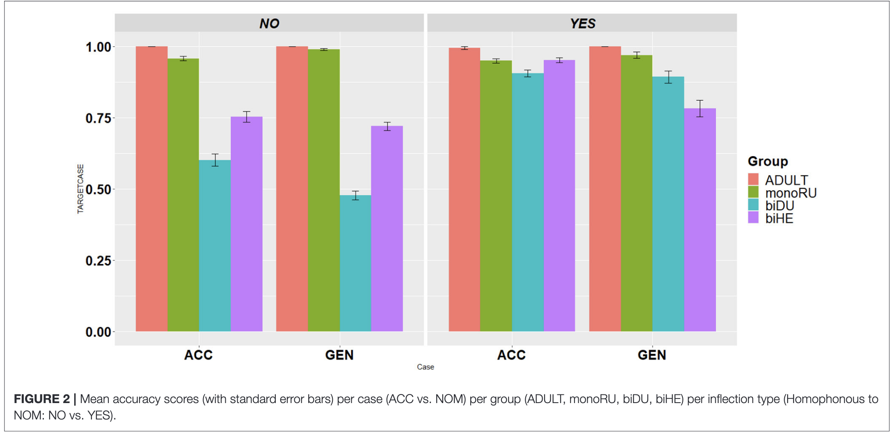
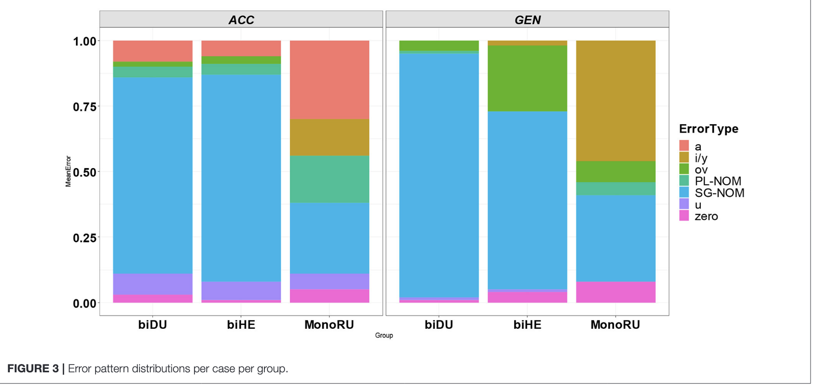
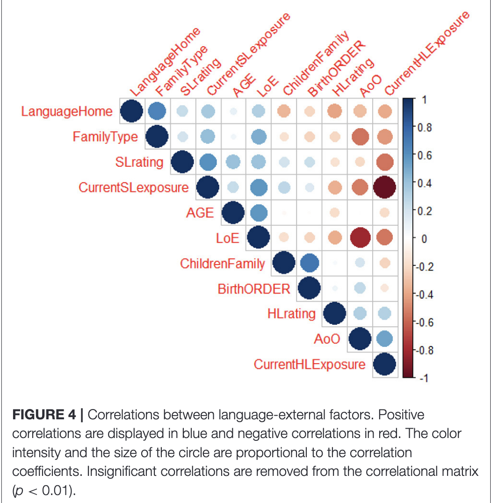
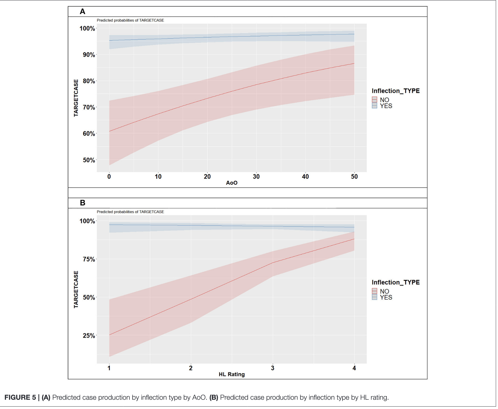

------------------------------------------------------------------------

## Was haben wir letztes Mal besprochen?

**Agens Präferenz** [@abbot-smith2017]

[Do two and three year old children use an incremental first-NP-as-agent bias to process active transitive and passive sentences?: A permutation analysis]{style="color: #3b0767ea; "}

[Heute: Bilingualism und Herkunftssprache ('heritage languages') ]{style="color: #3b0767ea; "}

## Studienleistung B

::: {style="font-size: 80%;"}

| Sitzung | Datum | Verantwortliche |
|---|---|----------|
| 10 | 09.07.2026 |  [ES]{style="color: #3b0767ea; "}: @gertner2006 und [MD]{style="color: #3b0767ea; "}: @dittmar2008 |
| 11 | 16.07.2026 |  [\[RR & NAS\]]{style="color: #3b0767ea; "}: @brandt2016 |
| 12 | 23.07.2026 |  [ML]{style="color: #3b0767ea; "}: @kamide2003 und [\[AK & RSL\]]{style="color: #3b0767ea; "}: @ferreira2003 | 

:::

::: notes

- ES: 1) Gertner 2) Brandt
- MD: 1) Dittmar 2) Gertner 
- ML: 1)  Ferreira (2003)" 2)  "Kamide et al. (2003)"
- AK & RS: 1)  Brandt et al. (2016) 2) Ferreira (vorzugsweise 23.07)
- RR & NS: 1) Brandt et al. 

Fragen?

:::

## Child Heritage Language Development: An Interplay Between Cross-Linguistic Influence and Language-External Factors [@meir2021]

---------------

### Einführung

Was ist eine *Heritage Language*?

In Gruppen:

1.  Was wird mit 'cross-linguistic factors' gemeint?
2.  Was wird mit 'language-external factors' gemeint?

Was für unterschiedliche Situationen könnt ihr euch vorstellen, in denen diese Aspekte variieren?

---------------------

### Studie

- Was sind die drei Forschungsfragen, die die Autorinnen untersuchen? 
- Welche Sprachen und was sind die relevanten Eigenschaften?

---------------------

### Studiendesign

1. Probandengruppen
2. Experimente: Was ist das experimentelle Paradigma ("Aufgabe")?
3. Welche "language-external" Faktoren wurden untersucht?

---------------------

### Resultate

- RQ1: cross-linguistic influence (Testergebnisse und Fehleranalyse)
- RQ2: language-external factors
- RQ3: effect of language-external factors on cross-linguistic influenc

---------------------

### Resultate

**RQ1: cross-linguistic influence**

---------------------

### Resultate

**RQ1: cross-linguistic influence**

---------------------

### Resultate

**RQ2: language-external factors**

---------------------

### Resultate

**RQ2: language-external factors**

---------------------

### Resultate

**RQ3: effect of language-external factors on cross-linguistic influence**

---------------------

### Fazit

- Kritikpunkte
- Wie könnte man die Studie "verbessern" oder was könnte man anders machen?
- Was wäre andere interessante Bevölkerungsgruppen, multilinguale Kontexte ('linguistic ecologies')?

::: notes

 HL ratings und SL ratings: sind das wirklich "language-external factors"?

:::

# Referenzen {.scrollable}

::: {#refs}
:::