------------------------------------------------------------------------

## Von Sprachverstehen zu Sprachproduktion

Heute: @norcliffe2015

##  Von Sprachverstehen zu Sprachproduktion

::: {style="font-size: 80%;"}

Diese beiden Aspekte der Sprachverarbeitung werden in der Psycholinguistik oft separat behandelt.

Aber:

- Wie verhalten sich Sprachverstehen und Sprachproduktion zu einander?
- Unterliegen Sprachverstehen und Sprachproduktion unterschiedliche Prozesse?
- Wo liegen Gemeinsamkeiten? Wo Unterschiede? 
- Und wie beeinflussen sie sich gegenseitig?

:::

----------------

### "Traditionelle" Modelle

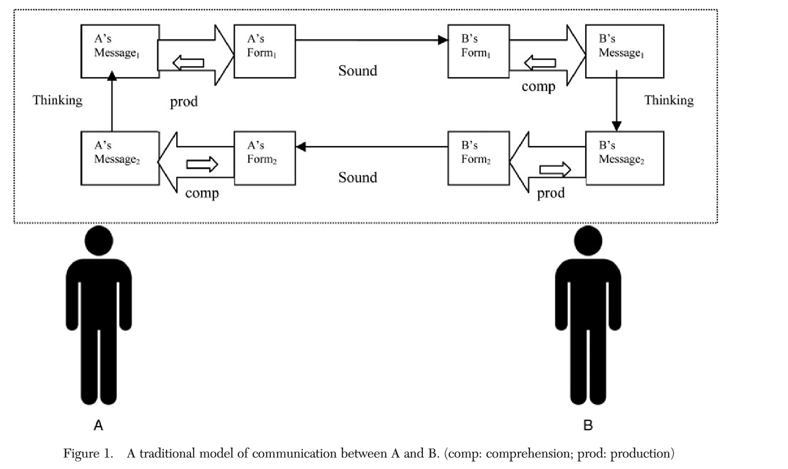

[@pickering2013]

----------------

### *An integrated theory of language production and comprehension* [@pickering2013]

@pickering2013, p.329: "\[...\] we propose that producing and understanding are tightly interwoven, and this interweaving underlies people’s ability to predict themselves and each other."

- Sprachproduktion = Aktion
- Sprachverarbeitung = Wahrnehmung [von einer Aktion]{style="color: #175e53ea; "}

----------------

### Production-Distribution-Comprehension (PDC) account [@macdonald2013]

- Prozesse in der Produktion beeinflussen den Sprachgebrauch, welcher wiederum das Sprachverstehen beeinflusst
  - Prozesse in der Produktion: (Arbeits-)gedächtnis, Anforderungen an die Satzplanung, ...

["This approach contrasts with classic theories in which comprehension behaviors are attributed to innate design features of the language comprehension system and associated working memory. The PDC instead links basic features of comprehension to a different source: production processes that shape language form."[@macdonald2013, p.1]]{style="color: #2f4b47d8; font-size: 70%; "}

----------------

### Good-enough Processing

- Sprachverstehen ist nur "good enough" [@ferreira2002]
- Interpretationsfehler werden nicht zwingend reanalysiert sondern bestehen in manchen Fällen
- "Our fundamental proposal is that given or presupposed information is processed in a good-enough manner, while new or focused information is the target of the comprehender's prediction efforts." [@ferreira2007, abstract]

----------------

### ... & Production?

::: {style="font-size: 80%;"}

- laut @goldberg2022 ist auch Sprachproduktion nur "good-enough"
- "During production, forms are necessarily articulated, but the selected forms do not necessarily optimally convey the intended message." [@goldberg2022, p. 301]
- beide Prozesse können zu Misverständnissen führen, weil sie nur "good-enough" sind

:::

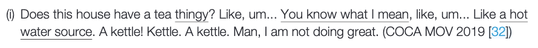

[[@goldberg2022]]{style="color: #636d6bd8; font-size: 70%; "}

----------------

### Turn-taking

[Sprachverstehen und Sprachproduktion passieren oft simultan]{style="font-size: 70%; "}

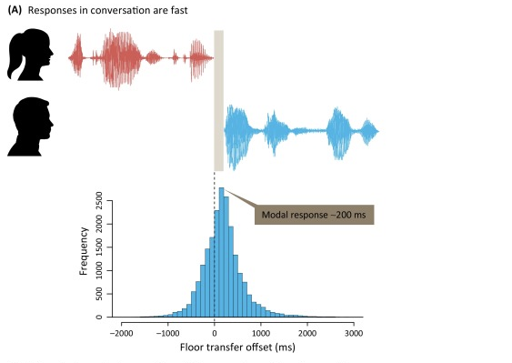{width=1000}

[[@levinson2016]]{style="color: #636d6bd8; font-size: 70%; "}

[Übrigens: Die Zeitspanne von 200ms ist sprachübergreifend ziemlich konsistent, siehe @stivers2009]{style="color:#2f4b47d8; font-size: 70%; "}

----------------

**Turn taking** 

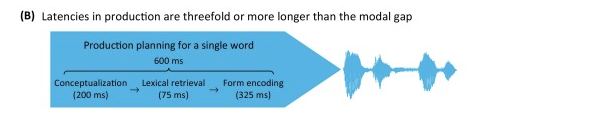

[[@levinson2016]]{style="color: #636d6bd8; font-size: 70%; "}

----------------

**Turn taking** 

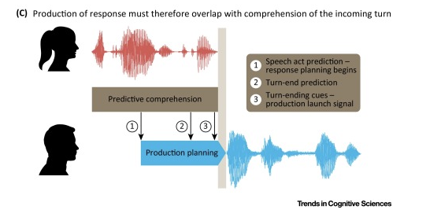

[[@levinson2016]]{style="color: #636d6bd8; font-size: 70%; "}

## Modell von Sprachproduktion von @levelt1989

[[@levelt1989]]{style="color: #636d6bd8; font-size: 70%; "}

## @norcliffe2015: Hintergrund

- Was wird mit Inkrementalität gemeint?
- *Linear vs. Structural Incrementality*: Wie unterscheiden sich diese beiden Theorien?
    - In "Visual World" Experimenten: Wie erklären die beiden Theorien  was in einem Bild fixiert wird?
- Wie beeinflusst *Accessibility* die Sprachproduktion?

-------------------

### @norcliffe2015: Motivation & Ziel der Studie

- Einfluss der Worstellung auf die Satzplanung
- Bildbeschreibung mit Eye-Tracking 
- Experiment 1: Tzeltal
- Experiment 2: Niederländisch

-------------------

### Tzeltal

::::::::: columns
::::: {.column width="45%"} 
::: {style="font-size: 70%;"}

**Aktiv**: 

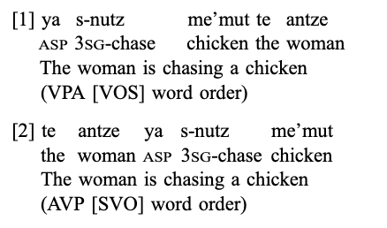

VPA (VOS) = Grundworstellung (66 %), AVP (SVO) = alternative Worstellung (33 %)

:::

:::::

::::: {.column width="55%"} 
::: {style="font-size: 70%;"}

**Passiv**:

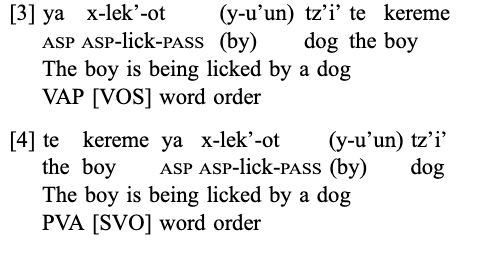

VAP (VOS) = Grundworstellung für Passiv

:::
::::
::::::::: 

[[@norcliffe2015, p. 1190]]{style="color: #636d6bd8; font-size: 70%; "}

-------------------

### Forschungsfragen

1. Conceptual accessibility and structure choice: 'radical' linear incrementality or subject selection?
2. Perceptual accessibility and structure choice: ‘radical’ linear incrementality or subject selection? 
3. Time course of formulation for verb-initial and subject-initial sentences: does grammatical structure determine when speakers encode the verb and the subject

-------------------

### Experimentdesign

- vier Bedingungen mit unterschiedliche Arten von Ereignissen:
    - A & P = menschlich
    - A = menschlich, P = Tier
    - A = unbelebt oder Tier, P = menschlich 
    - A = unbelebt oder Tier, P = Tier

-------------------

### Resultate
1. Conceptual accessibility and structure choice: 'radical' linear incrementality or subject selection?

::::::::: columns
::::: {.column width="70%"} 

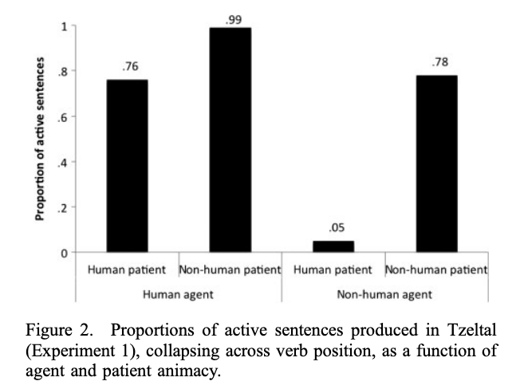

::::

::::: {.column width="30%"} 
::: {style="font-size: 70%;"}

- Diathese (Subjektwahl) ist durch die Belebtheit/Menschlichkeit der Referenten beeinflusst
- keine Interaktion zwischen Worstellung und Belebtheit des Agens und zwischen Worstellung und Belebtheit des Patiens

:::
:::::
:::::::::

-------------------

### Resultate

1. *Conceptual accessibility and structure choice: 'radical' linear incrementality or subject selection?*

::::::::: columns
::::: {.column width="70%"} 

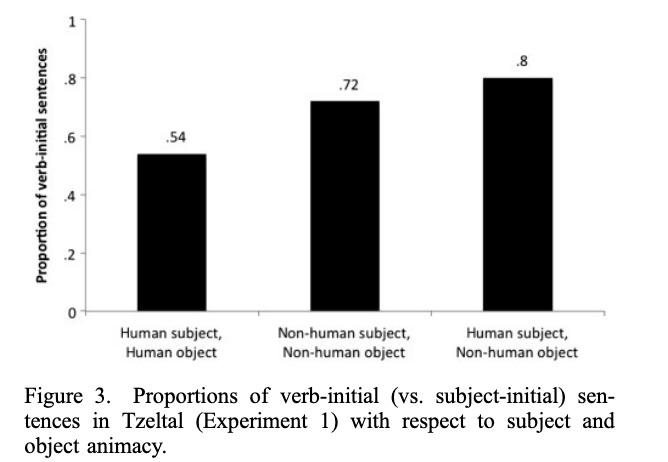{width=600}

::::

::::: {.column width="30%"} 
::: {style="font-size: 70%;"}

- Subjekt-initiale Worstellung kommt nicht häufiger mit einem einzelnen "conceptual accessible" Referenten. 
- Welcher Theorie widerspricht dies?

:::
:::::
:::::::::

-------------------

### Resultate

2. *Perceptual accessibility and structure choice: ‘radical’ linear incrementality or subject selection?*

::::::::: columns
::::: {.column width="70%"} 

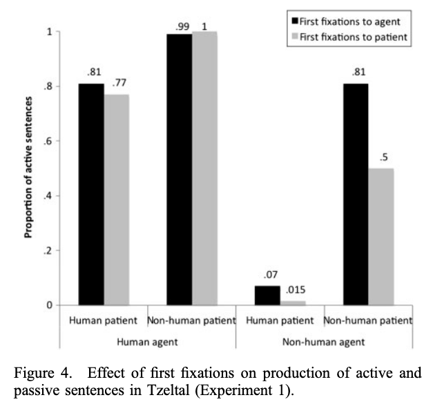{width=400}

::::

::::: {.column width="30%"} 
::: {style="font-size: 70%;"}
- Fixierung beeinflusst die Zuordnung des Subjekts nicht 
- Fixierungen und Strukturwahl: zu einem gewissen Grade getrennt
:::
:::::
:::::::::

-------------------

### Resultate

3. *Time course of formulation for verb-initial and subject-initial sentences*

[**Verb-mediale Worstellung**]{style="font-size: 80%; "}

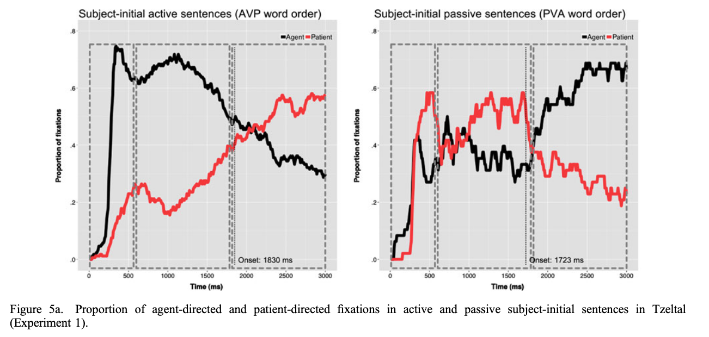

-------------------

### Resultate

3. *Time course of formulation for verb-initial and subject-initial sentences*

[**Verb-initiale Worstellung**]{style="font-size: 80%; "}

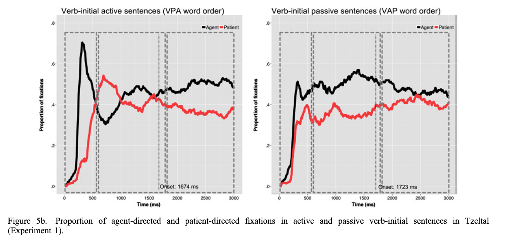

-------------------

### Resultate: Zusammenfassung 

::: {style="font-size: 60%;"}
- Worstellung und Voice beeinflusst durch Belebtheit der Referenten, nicht durch Fixierung
- Einfluss von `conceptual accessibility' auf Voice:
    - mit menschlichen Agens: Aktiv häufiger als Passiv
    - mit menschlichen Patiens: Passiv häufiger als Aktiv
- Einfluss von Belebtheit auf Wahl von Aktiv vs. Passiv zeigt sich in beiden Worstellungen 
    - *'radical' linear incrementality or subject selection?*
    - Was bedeutet das für den *planning scope*?
- Subjekt- vs. Verb-initiale Strukturen:
    - nicht beeinflusst durch die Belebtheit
    - Subjekt-initale Worstellung: häufiger wenn Subjekt und Objekt die gleichen Belebtheitscharakteristiken hatten
- keinen Einfluss von *perceptual Accessibility* auf die Wahl der Struktur
:::

-------------------

### Vergleich mit Niederländisch {.scrollable}

::: {style="font-size: 80%;"}
- viele Parallelen:
    - Wahl der Struktur hing vom der Belebtheit der Referenten ab
    - in SVO-Sätzen: ähnliche Fixierungsmuster
- Unterschiede:
    - viel mehr aktive Sätze im Niederländischen als in Tzeltal
    - erste Fixierung hatte einen kleinen Einfluss auf die Strukturwahl im Niederländische (in Tzeltal: keinen Einfluss)
    - Verbinitiale-Sätze: nur im Tzeltal untersucht, aber deutliche Unterschiede im Fixierungsmuster im Vergleich zu SVO-Sätze
:::

# Referenzen {.scrollable}

::: {#refs}
:::